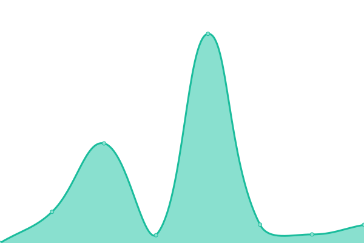

# [📈 Live Status](https://uptime.skywt.cn): <!--live status--> **🟧 Partial outage**

This repository contains the open-source uptime monitor and status page for [SkyWT](https://skywt.cn/), powered by [Upptime](https://github.com/upptime/upptime).

With [Upptime](https://upptime.js.org), you can get your own unlimited and free uptime monitor and status page, powered entirely by a GitHub repository. We use [Issues](https://github.com/Skywt2003/uptime/issues) as incident reports, [Actions](https://github.com/Skywt2003/uptime/actions) as uptime monitors, and [Pages](https://uptime.skywt.cn) for the status page.

<!--start: status pages-->
<!-- This summary is generated by Upptime (https://github.com/upptime/upptime) -->
<!-- Do not edit this manually, your changes will be overwritten -->
<!-- prettier-ignore -->
| URL | Status | History | Response Time | Uptime |
| --- | ------ | ------- | ------------- | ------ |
|  [SkyWT](https://skywt.cn) | 🟥 Down | [sky-wt.yml](https://github.com/Skywt2003/uptime/commits/HEAD/history/sky-wt.yml) | 

 1021ms
     
 | 

<a href="https://uptime.skywt.cn/history/sky-wt">98.20%</a>
    

|  [Blog](https://blog.skywt.cn) | 🟩 Up | [blog.yml](https://github.com/Skywt2003/uptime/commits/HEAD/history/blog.yml) | 

 4560ms
     
 | 

<a href="https://uptime.skywt.cn/history/blog">100.00%</a>
    

|  [Vultr Server](https://v.skywt.cn) | 🟩 Up | [vultr-server.yml](https://github.com/Skywt2003/uptime/commits/HEAD/history/vultr-server.yml) | 

 640ms
     
 | 

<a href="https://uptime.skywt.cn/history/vultr-server">100.00%</a>
    

|  [Vultr Server (Cloudflare)](https://skywt.tech) | 🟩 Up | [vultr-server-cloudflare.yml](https://github.com/Skywt2003/uptime/commits/HEAD/history/vultr-server-cloudflare.yml) | 

 198ms
     
 | 

<a href="https://uptime.skywt.cn/history/vultr-server-cloudflare">100.00%</a>
    

<!--end: status pages-->

[**Visit our status website →**](https://uptime.skywt.cn)

## 📄 License

- Powered by: [Upptime](https://github.com/upptime/upptime)
- Code: [MIT](./LICENSE) © [SkyWT](https://skywt.cn/)
- Data in the `./history` directory: [Open Database License](https://opendatacommons.org/licenses/odbl/1-0/)
